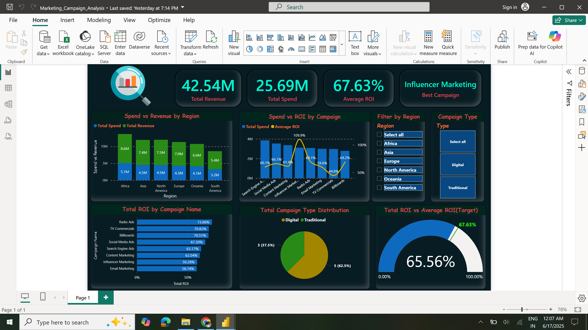

# 📊 Marketing Campaign Analysis – Power BI Dashboard



## 📌 Project Overview

The **Marketing Campaign Analysis** project is a Power BI dashboard designed to evaluate and compare the effectiveness of various digital and traditional marketing campaigns across regions. It highlights key performance indicators (KPIs) like ROI, revenue, and spend, enabling data-driven decision-making and optimization of future marketing strategies.

---

## 🎯 Objectives

- Integrate and model data from multiple marketing sources.
- Create meaningful KPIs using DAX (e.g., ROI, conversions, revenue).
- Identify high- and low-performing campaigns and regions.
- Build an interactive and intuitive dashboard to support marketing insights.

---

## 📁 Dataset Overview

The project utilizes three structured CSV datasets:

| Dataset Name                 | Description                                                                 |
|-----------------------------|-----------------------------------------------------------------------------|
| `Marketing_Campaign_Details` | Contains campaign type (Digital/Traditional), average spend, and ROI.      |
| `Marketing_Campaign_Performance` | Campaign-level data with impressions, clicks, conversions, spend, revenue, and ROI across regions and industries. |
| `Region_Performance`         | Aggregated performance metrics for each region including total spend, revenue, and average ROI. |

> ✅ Cleaned and transformed using Power Query.  
> ✅ Data types standardized, duplicates removed, and column names renamed for clarity.

---

## 🧩 Data Modeling

- Followed **star schema** with `Marketing_Campaign_Performance` as the fact table.
- Established **one-to-many** relationships:
  - `Campaign_Name` between `Campaign_Details` and `Campaign_Performance`.
  - `Region` between `Region_Performance` and `Campaign_Performance`.
- Ensured proper filtering flow and efficient query execution.

> 📌 **Note:** All relationships use single-directional filtering to optimize performance and avoid ambiguity in DAX measures.

---

## 🧠 DAX Measures

Key DAX measures created:

```DAX
Total Impressions   = SUM(Marketing_Campaign_Performance[Impressions])
Total Clicks        = SUM(Marketing_Campaign_Performance[Clicks])
Total Conversions   = SUM(Marketing_Campaign_Performance[Conversions])
Total Spend         = SUM(Marketing_Campaign_Performance[Spend])
Total Revenue       = SUM(Marketing_Campaign_Performance[Revenue])
Total ROI           = DIVIDE([Total Revenue] - [Total Spend], [Total Spend])
Average ROI         = AVERAGE(Marketing_Campaign_Performance[ROI])
```

🏆 **Best Campaign Identification:**

```DAX
Best Campaign =
VAR MaxROI = MAX(Marketing_Campaign_Performance[ROI])
RETURN
    CALCULATE(
        FIRSTNONBLANK(Marketing_Campaign_Performance[Campaign_Name], 1),
        Marketing_Campaign_Performance[ROI] = MaxROI
    )
```

---

## 📊 Visualizations

| Visual Type            | Insight Provided                                      |
|------------------------|--------------------------------------------------------|
| **Stacked Column Chart** | Compare Total Spend vs Revenue by Region.             |
| **Combo Chart**         | Total Spend and Average ROI by Campaign.              |
| **Bar Chart**           | Total ROI per Campaign.                               |
| **Pie Chart**           | Campaign distribution by Type (Digital/Traditional). |
| **Gauge Chart**         | Total ROI against benchmark.                          |
| **KPI Cards**           | Summary of Total Revenue, Spend, ROI, Best Campaign.  |

📌 **Slicers** allow dynamic filtering by Region and Campaign Type.

---

## 🔍 Key Insights

1. **Digital campaigns outperformed traditional channels**, indicating better ROI efficiency.
2. **Influencer Marketing** had the highest ROI (~109%), making it the most effective strategy.
3. **Email Marketing** showed the lowest ROI, requiring strategic review.
4. **North America** demonstrated the strong regional performance.
5. The **Total ROI** across all campaigns is **65.56%**, and the **average ROI** is 67.63%.

---

## 🧰 Tools & Technologies

- **Power BI Desktop**
- **Power Query** for ETL
- **DAX** for KPI creation
- **CSV** datasets (mock data)

---

## 🚀 How to Use

1. Clone or download this repository.
2. Open the `.pbix` file using Power BI Desktop.
3. Refresh the data connections if needed.
4. Use slicers to filter by region or campaign type to explore insights dynamically.

---

## 📂 Repository Structure

```
📁 Marketing-Campaign-Analysis/
│
├─ 📂 data/
│   ├─ Marketing_Campaign_Details.csv
│   ├─ Marketing_Campaign_Performance.csv
│   └─ Region_Performance.csv
│
├─ 📂 images/
│   └─ Marketing_Campaign_Analysis.png
│
├─ Marketing_Campaign_Analysis.pbix
└─ README.md
```

---

## 🧠 Theory Corner

> - **ROI** = `(Revenue - Spend) / Spend`. A critical metric for evaluating marketing effectiveness.
> - **CTR (Click Through Rate)** = `Clicks / Impressions`, reflects ad engagement.
> - **Conversion Rate** = `Conversions / Clicks`, measures post-click performance.
> - **Total ROI** vs **Average ROI** comparison helps assess the skewness of campaign performance.
> - **Star schema** modeling enhances DAX performance and visualization responsiveness.

---
